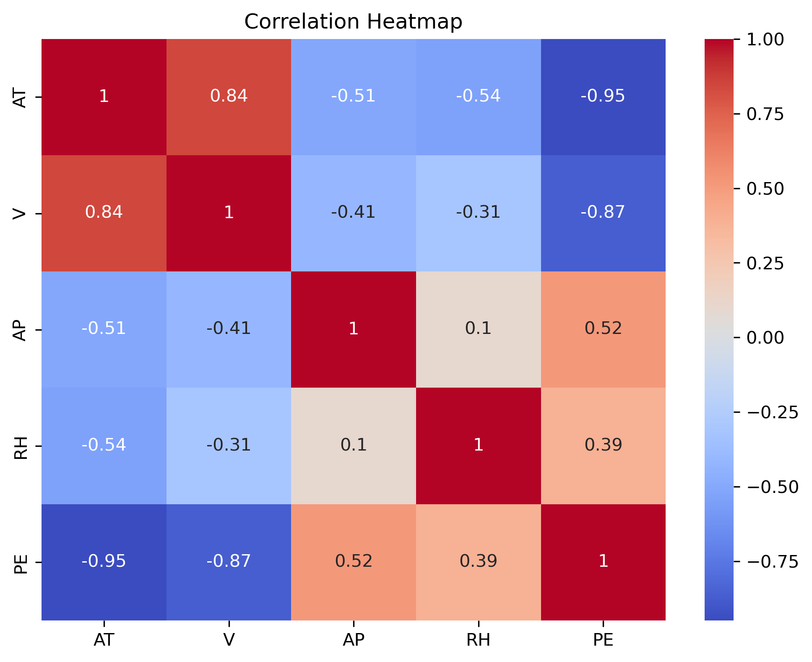

# Power Plant Energy Output Prediction

## Project Overview

This project builds a machine learning model to predict hourly net electrical energy output (MW) of a Combined Cycle Power Plant (CCPP).

Combined Cycle Power Plants generate electricity using gas turbines, steam turbines, and heat recovery steam generators. Environmental conditions significantly affect plant efficiency and output.

Using historical sensor data, I modeled the relationship between ambient conditions and electrical energy production and compared multiple regression approaches to identify the most accurate and stable model.

---

## Dataset

The dataset contains **9,568 hourly observations** of ambient environmental readings and corresponding power output.

### Input Features
- **AT** — Ambient Temperature (1.81°C to 37.11°C)
- **V** — Exhaust Vacuum (25.36–81.56 cm Hg)
- **AP** — Ambient Pressure (992.89–1033.30 millibar)
- **RH** — Relative Humidity (25.56%–100.16%)

### Target Variable
- **PE** — Net hourly electrical energy output (420.26–495.76 MW)

### Data Source

Tüfekci, P. (2014). *Prediction of full load electrical power output of a base load operated combined cycle power plant using machine learning methods.*  
International Journal of Electrical Power & Energy Systems, 60, 126–140.

Kaya, H., Tüfekci, P., & Gürgen, S. F. (2012).  
*Local and Global Learning Methods for Predicting Power of a Combined Gas & Steam Turbine.*

---

## Problem Type

Supervised Regression

Goal: Predict continuous power output (MW) using environmental inputs.

---

## Modeling Process

### 1. Data Exploration

- Verified data completeness (no missing values)
- Reviewed feature distributions
- Evaluated correlation structure
- Identified strong negative correlation between temperature and power output (−0.95)

Temperature and exhaust vacuum show strong relationships with power output, suggesting both linear and nonlinear effects.

---

### 2. Data Splitting Strategy

The dataset was split into:

- **80% training data**
- **20% test data (held out for final evaluation)**

The test set was never used during model selection.

---

### 3. Validation Strategy

To ensure robust model comparison, **5-fold cross-validation** was performed on the training data.

Process:

1. The training data was divided into 5 folds.
2. The model was trained 5 times.
3. Each fold served once as validation while the remaining folds were used for training.
4. The Mean Absolute Error (MAE) was recorded for each fold.
5. Final validation performance was calculated as the average MAE across all folds.

This approach reduces variance from a single random split and provides a more reliable estimate of model performance.

---

### 4. Evaluation Metric

**Mean Absolute Error (MAE)** was selected because:

- It represents average prediction error directly in MW.
- It is easy to interpret operationally.
- It is less sensitive to extreme errors than RMSE.

---

## Model Comparison

### Linear Regression (Baseline)

- Cross-Validated MAE: ~3.63 MW  
- Test MAE: **3.60 MW**  
- Test R²: 0.93  

The linear model captured most of the variance but assumed strictly linear relationships.

---

### Random Forest Regressor

- Cross-Validated MAE: ~2.47 MW  
- Test MAE: **2.31 MW**  
- Test R²: **0.964**

Random Forest reduced prediction error by approximately **36%** compared to the linear baseline.

Feature importance analysis showed:

- Ambient Temperature ≈ 90% importance
- Exhaust Vacuum ≈ 6% importance
- Ambient Pressure & Humidity contribute smaller incremental gains

---

## Key Insights

- Ambient Temperature is the dominant driver of power output.
- Exhaust Vacuum provides meaningful additional predictive signal.
- The relationship between environmental variables and power output is nonlinear.
- Cross-validation confirmed strong generalization and model stability.

---

## Reproducibility

To recreate the environment:

### Option 1: Conda
conda env create -f environment.yml
conda activate course1

### Option 2: Using pip
pip install -r requirements.txt

Then run the notebook:
AI-PM-Course1.ipynb

## Tools Used
 - Python
 - pandas
 - scikit-learn
 - matplotlib
 - seaborn
 - Jupyter Notebook

